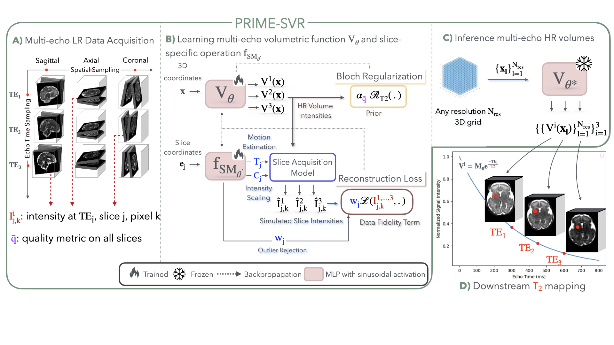

# PRIME-SVR
Physics-infoRmed Implicit Multi-Echo Slice-to-Volume Reconstruction for Fetal T2 mapping
[](https://arxiv.org/abs/2508.10680)

## Overview
**PRIME-SVR** is the first implicit neural representation (INR) framework for **joint multi-echo slice to volume reconstruction from motion corrupted 2D slice stacks of fetal MRI**. The method is **fully self-supervised**, trained for each subject: no ground-truth HR volume, no T2 values, no external motion estimation network are required.

## Method

- A **single fully connected network ($V_\theta$, a SIREN)** learns a continuous function shared across all TEs, mapping spatial coordinates directly to signal intensities at every echo time. Because this function is common to all TEs, information about the underlying anatomy is naturally shared and reinforced across echoes rather than being reconstructed independently for each one.
- A **second network ($f_{SM_\theta}$, a SIREN)** estimates slice-specific acquisition degradations (rigid motion, intensity scaling, outlier weighting) directly from the slice coordinates.
- **Cross-TE coherence is enforced through a Bloch-equation-derived regularization** that penalizes deviations from the expected mono-exponential T2 decay, with an adaptive weighting **$\alpha$** that strengthens the coupling for degraded stacks and relaxes it for high-quality acquisitions.

## Data preparation
PRIME-SVR expects, per subject:
- At least one orthogonal stack at at least 3 different TEs, or any number of stacks acquired at different TEs (more than 3 TEs is also supported),
- Brain masks for each stack,
- Echo times (in ms),
- Average quality metric score computed with [FetMRQC](https://hub.docker.com/r/thsanchez/fetmrqc) (optional, for optimal regularization strength **$\alpha$**).


**Recommended preprocessing before running PRIME-SVR:**
- **Denoising** of every stack (e.g. non-local means, as implemented in [ANTs](https://antspy.readthedocs.io/en/latest/api/ants.ops.denoise_image.html)
- **Bias field correction**, run slice-wise on each stack [N4 bias field correction](https://antspyx.readthedocs.io/en/latest/api/ants.ops.bias_correction.html).
  
Both steps are handled outside the main pipeline and should be applied to the raw stacks beforehand.

## Installation

1. **Clone the repository:**
```bash
git clone https://github.com/<your-org>/PRIME-SVR.git
cd PRIME-SVR
```

2. **Create the conda environment** using the provided full requirements file:
```bash
conda create -n prime-svr python=3.11.4
conda activate prime-svr
pip install -r requirements_full.txt
```

## Start
Reconstruction is driven by a single YAML configuration file, passed to the main training/reconstruction script:
```bash
cd PRIME-SVR
python run_prime_svr.py --config configs/config.yaml
```

The config file contains default parameters, but you need to fill it in with your data (guided in the config file).

The regularization coefficient **$\alpha$** can be left at its default value, or set optimally based on the quality score using the following rule:

$$
\alpha(\bar{q}) =
\begin{cases}
[10, 30], & \text{if } \bar{q} < 0.9 \text{ or fewer than 3 stacks/TEs}, \\
\ ]0, 1], & \text{if } \bar{q} \ge 0.9.
\end{cases}
$$

## Acknowledgments
This repository builds upon the implicit neural representation SIREN-based slice-to-volume reconstruction frameworks developed by **Maik Dannecker** and **Steven Jia** for multi-contrast (T1w/T2w) fetal MRI reconstruction. We acknowledge their foundational work, which this project extends to the joint multi-echo, physics-informed SVR for T2 mapping setting.

## Citation
If you use PRIME-SVR in your research, please cite:
```bibtex
@article{bulut2025primesvr,
  title   = {Physics-Informed Joint Multi-TE Super-Resolution with Implicit Neural Representation for Robust Fetal T2 Mapping},
  author  = {Bulut, Busra and Dannecker, Maik and Sanchez, Thomas and Neves Silva, Sara and Jia, Steven and Ledoux, Jean-Baptiste and Pomar, Leo and Sichitiu, Joanna and Gomez, Yvan and Koob, Meriam and Dunet, Vincent and Deprez, Maria and Auzias, Guillaume and Rousseau, Fran\c{c}ois and Hutter, Jana and Rueckert, Daniel and Bach Cuadra, Meritxell},
  journal = {arXiv preprint arXiv:2508.10680},
  year    = {2026}
}
```

## Contact
For questions, please open an issue or contact **Busra Bulut** — busra.bulut@unil.ch — Department of Radiology, Lausanne University Hospital and University of Lausanne.

## Contact

For questions, please open an issue or contact **Busra Bulut** — busra.bulut@unil.ch — Department of Radiology, Lausanne University Hospital and University of Lausanne.
